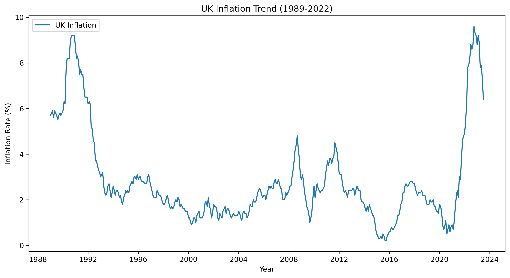
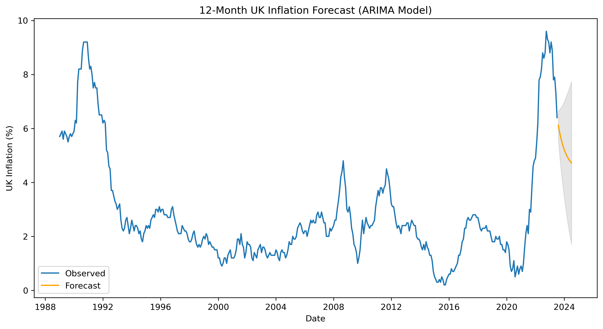

**UK Inflation (CPIH) Time Series Analysis & Forecasting (1989–2022)**

**Overview**

This project presents a comprehensive time series analysis of UK inflation using the Consumer Prices Index including owner occupiers’ housing costs (CPIH). Covering over three decades of monthly data (1989–2022), the analysis explores long-term inflation trends, seasonal patterns, and short-term volatility, and produces a 12-month forward-looking forecast using an ARIMA model.

The objective is to demonstrate how applied data science and statistical modelling can support economic understanding, policy analysis, and data-driven decision-making in real-world contexts.
 
**Why This Matters**

Inflation is one of the most critical economic indicators affecting households, businesses, and governments. In the UK, inflation directly influences:

•	Monetary policy decisions by the Bank of England

•	Interest rates, wages, and household purchasing power

•	Business pricing strategies and investment planning

•	Public confidence in economic stability

By analysing long-term inflation patterns and forecasting future movements, this project provides insight into how data analytics can be used to anticipate economic pressures and inform strategic responses — particularly during periods of volatility such as the post-pandemic cost-of-living crisis.
 
**Objectives**

•	Analyse long-term trends in UK CPIH inflation (1989–2022)

•	Identify seasonal and cyclical patterns in inflation data

•	Build and interpret an ARIMA time series model

•	Forecast UK inflation for the next 12 months

•	Evaluate model performance using standard error metrics

•	Translate technical outputs into economic insight
 
**Data Source**

•	Dataset: UK CPIH (Consumer Prices Index including owner occupiers’ housing costs)

•	Publisher: Office for National Statistics (ONS)

•	Source: Kaggle (ONS Open Data)

•	Licence: Open Government Licence v3.0

•	Frequency: Monthly

CPIH provides a more comprehensive measure of inflation than CPI by incorporating housing costs, making it particularly relevant for understanding the lived economic experience of UK households.

 **Exploratory Analysis & Visualisations**

**UK Inflation (CPIH) Trend: 1989-2022**

This chart shows long-term evolution of UK inflation over more than three decades. Inflation remains relatively stable between 2010 and 2020 before rising sharply post-2021, reflecting pandemic related supply shocks, energy price increases, and monetary tightening cycles.

**Seasonal Decomposition of the UK Inflation**

The decomposition separates inflation into trend, seasonal, and residual components. While inflation is primarily trend-driven, the seasonal component suggests recurring short-term flunctuations, likely influenced by energy prices and consumer spending cycles. Residuals capture irregular economic shocks.

**12-Month UK Inflation Forecast with 95% Confidence Intervals**

The ARIMA-based forec ast suggests a gradual moderation of inflation over the next 12 months following the post-pandemic surge. The widening confidence interval reflects continued uncertainty driven by external factors such as energy markets, geopolitical risks, and monetary policy decisions.

**Methodology**

1. Data Preparation

•	Converted year and month fields into a unified datetime index

•	Ensured chronological ordering and consistency

•	Validated data types and missing values

2. Exploratory Analysis

•	Visualised inflation trends over time

•	Examined volatility and regime changes

•	Identified structural shifts in inflation behaviour

3. Seasonal Decomposition

•	Decomposed the series into trend, seasonal, and residual components

•	Assessed the presence of recurring inflation patterns

4. Time Series Modelling

•	Built an ARIMA(1,1,1) model to capture autoregressive and moving average dynamics

•	Evaluated model fit using AIC and diagnostic statistics

•	Generated a 12-month inflation forecast with confidence intervals

5. Model Evaluation

•	Performed train-test validation (training data up to 2021, test data for 2022)

•	Evaluated performance using:
o	Mean Squared Error (MSE)
o	Mean Absolute Error (MAE)
o	Root Mean Squared Error (RMSE)
 
**Key Insights**

•	UK inflation exhibits clear long-term structural shifts, including:
o	High inflation in the early 1990s
o	Extended low-inflation stability between 2010–2020
o	Sharp post-2021 inflation driven by global shocks

•	The ARIMA forecast suggests a gradual moderation of inflation following the 2021–2022 surge, though uncertainty remains elevated

•	Confidence intervals highlight the sensitivity of inflation forecasts to external economic factors such as energy prices and monetary tightening
 
**Tools & Technologies**

•	Python

•	Pandas & NumPy

•	Matplotlib & Seaborn

•	Statsmodels (ARIMA, seasonal decomposition)

•	Jupyter Notebook
 
**Future Enhancements**

•	Incorporating exogenous variables (interest rates, GDP, energy prices)

•	Comparing ARIMA with advanced models (SARIMA, VAR, ML-based forecasting)

•	Automating data updates via ONS APIs

•	Deploying forecasts into an interactive dashboard (Power BI / Streamlit)
 
**Author**

Omobolanle Adetoyinbo

Data Analyst | Applied Machine Learning | Economic & Forecasting Analytics
