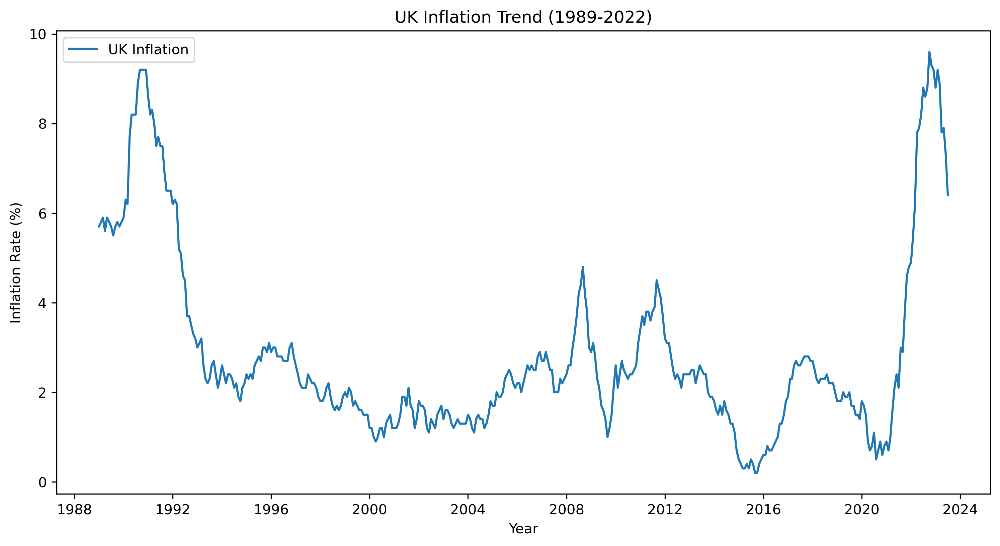
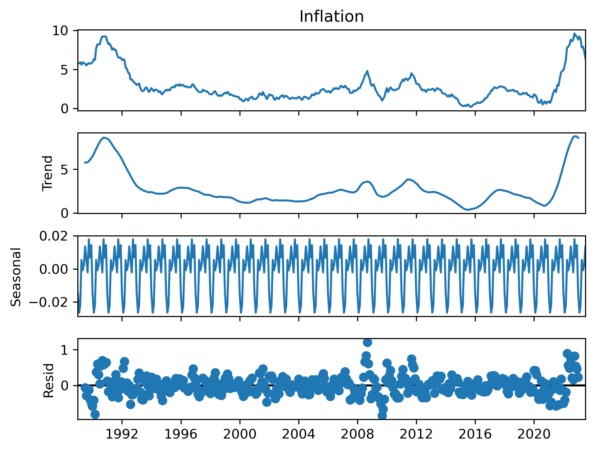
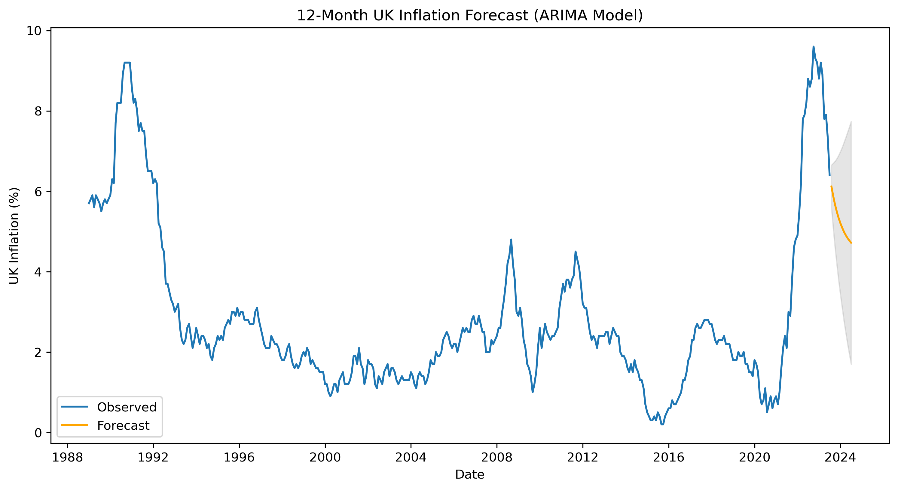

**UK Inflation (CPIH) Time Series Analysis & Policy-Relevant Forecasting (1989–2022)**

**Overview**

This project analyses long-term UK inflation dynamics using the **Consumer Prices Index including Owner Occupiers’ Housing Costs (CPIH)** from 1989 to 2022.
It applies **time-series decomposition and ARIMA** forecasting to identify historical trends, seasonal behaviour, and short-term inflation trajectories.

The analysis is designed to demonstrate how **data analytics and statistical modelling can support economic understanding and policy-relevant decision-making.**

## Project Objectives
- Analyse long-term inflation trends in the UK economy (1989 to 2022)
- Identify seasonal and structural patterns in CPIH data
- Develop and interpret an ARIMA forecasting model
- Evaluate model performance using real data
- Translate statistical outputs into meaningful economic insights

## Dataset
- Source: Office for National Statistics (ONS), via Kaggle
- Metric: CPIH
- Frequency: Monthly
- Period: 1989 – 2022
CPIH includes housing costs and provides a more comprehensive measure of inflation compared to CPI. 

## Exploratory Data Analysis (EDA)
The dataset was explored to understand long-term patterns and variability in inflation.
### Key Analyses:
- Inflation trend over time
- Distribution of inflation values
- 12-month rolling average to smooth short-term fluctuations

## Key Observations
- Elevated inflation in the early 1990s
- Stability between 2010 and 2020
- Sharp increase post-2021
- Evidence of cyclical behaviour

## Key Visual Insights

### UK Inflation Trend (1989–2022)

The chart shows the long-term evolution of UK inflation, highlighting:
- Elevated inflation in the early 1990s  
- A prolonged period of stability between 2010 and 2020  
- A sharp post-pandemic surge from 2021 onwards

### Trend and Seasonality Decomposition

Seasonal decomposition separates inflation into trend, seasonal, and residual components.  
The results indicate recurring monthly patterns alongside a clear long-term trend, supporting the use of time-series forecasting models.

### 12-Month Inflation Forecast (ARIMA)

The ARIMA forecast suggests a gradual moderation of inflation over the next 12 months.  
The confidence intervals highlight uncertainty driven by external economic factors such as energy prices, monetary tightening, and geopolitical risks.

## Why UK Inflation Matters

Inflation is a core indicator of economic stability and directly affects:

- Monetary policy decisions by the Bank of England  
- Business pricing and investment decisions 
- Household purchasing power and cost-of-living pressures
- Wage growth and labour market dynamics

By analysing inflation trends quantitatively, policymakers and analysts can better anticipate economic risks and design effective responses.

## Modelling Approach
A time series modelling approach was used due to the sequential nature of inflation data.
### Model Used:
ARIMA (1,1,1)
The model captures:
Dependence on past values
Trend removal through differencing
Error correction via moving averages

### Model Evaluation & Validation
To assess model performance, the dataset was split into:
- Training set: up to 2021
- Test set: 2022
The model was trained on historical data and evaluated using out-of-sample predictions.

### Evaluation Metrics
- **Mean Squared Error (MSE):** 6.36  
- **Mean Absolute Error (MAE):** 2.26  
- **Root Mean Squared Error (RMSE):** 2.52  

The results indicate reasonable short-term predictive accuracy for macroeconomic time-series data, while acknowledging uncertainty due to external shocks.

## Actual vs Predicted Comparison
The comparison between actual and predicted inflation values shows that the ARIMA model captures the general level of inflation but produces a relatively smooth forecast.

This indicates that while the model is effective at identifying overall trends, it struggles to capture sharp fluctuations and volatility.

## Model Limitations
- ARIMA relies only on historical values and excludes external economic factors
- Produces relatively flat forecasts, limiting responsiveness to volatility
- Cannot fully capture sudden economic shocks

## Project Improvements (Iteration)
This project was enhanced through iterative improvements:
- Added exploratory data analysis (EDA)
- Introduced rolling average trend analysis
- Implemented train-test split for validation
- Added actual vs predicted comparison
- Improved interpretation of model behaviour

## Economic Insights
- Inflation reflects broader economic cycles
- Post-pandemic inflation surge indicates structural shocks
- Forecast suggests gradual stabilisation
- Inflation analysis supports:
   - Monetary policy decisions
   - Business planning
   - Household financial planning

## Tools & Technologies
- Python (pandas, matplotlib, seaborn, statsmodels, scikit-learn)
- Jupyter Notebook

## Data Source
- **Dataset:** UK CPIH (Consumer Prices Index including Owner Occupiers’ Housing Costs)  
- **Time Period:** 1989–2022  
- **Publisher:** Office for National Statistics (ONS)  
- **Licence:** Open Government Licence v3.0  
- **Accessed via:** Kaggle  

## Future Enhancements
- Use SARIMA to capture seasonality
- Incorporate macroeconomic variables (GDP, interest rates)
- Compare with machine learning models
